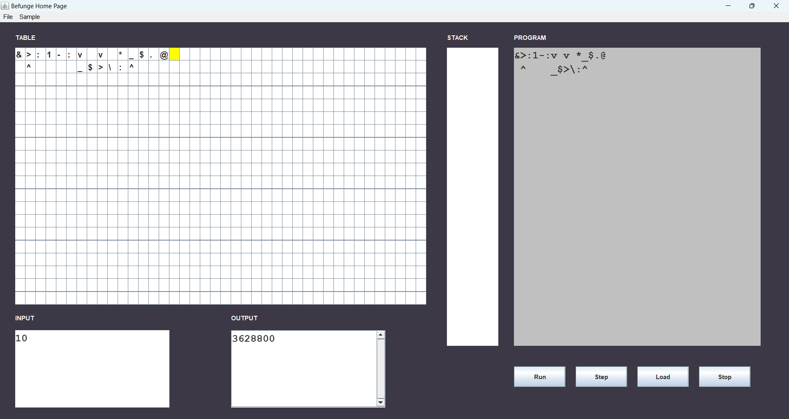
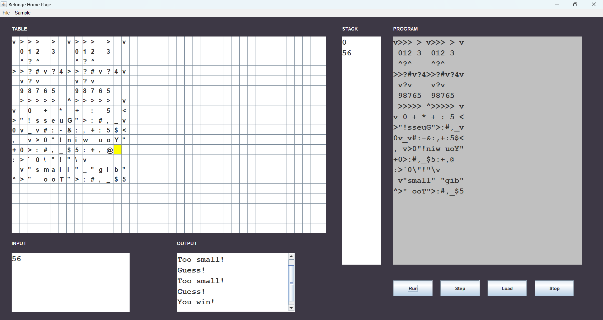

# Befunge Interpreter

A Java-based interpreter for the Befunge esolang, featuring a visual stack and execution display. This interpreter allows users to run Befunge programs and see step-by-step execution along with a visual representation of the stack.

## Features

- **Visual Execution**: Step-by-step visualization of Befunge program execution.
- **Stack Visualization**: Displays the state of the stack as the program runs.
- **Interactive Interface**: User-friendly interface for easier debugging and learning.

## Installation

### Prerequisites

- Java 8 or higher

### Steps

1. **Clone the Repository**:

    ```bash
    git clone https://github.com/Shubhamkashyap1601/Befunge.git
    ```

2. **Navigate to the Project Directory**:

    ```bash
    cd Befunge/src
    ```

3. **Compile the Code**:

    ```bash
    javac befunge/Interpreter/*.java
    ```

4. **Run the Interpreter**:

    ```bash
    java befunge.Interpreter.HomeGUI
    ```

## How to Use

1. **Open the Interpreter**:
   - Launch the interpreter with the following command:

    ```bash
    java befunge.Interpreter.HomeGUI
    ```

2. **Load a Befunge Program**: Use the GUI interface to open and load a Befunge program file.

3. **Execute the Program**: Use the provided controls to step through the execution and view the visual stack representation.

## Images

### 1. Factorial



### 2. Guess Number


